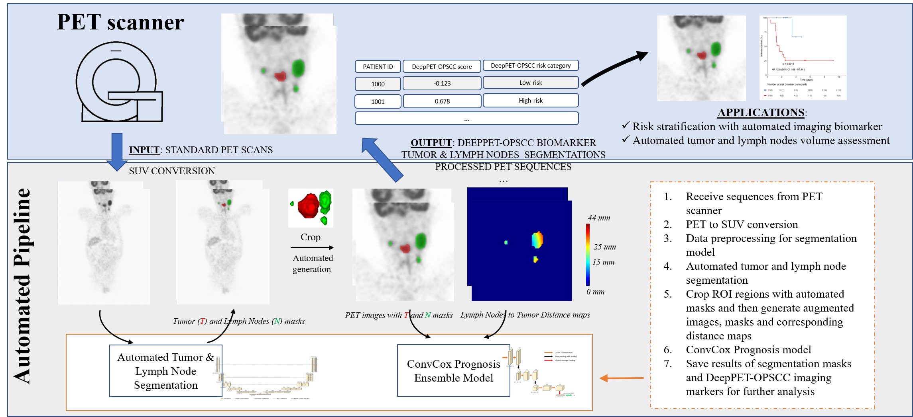

# DeepPET-OPSCC-Example
This is an example of running inference with trained DeepPET-OPSCC prognostic models. For the DeepPET-OPSCC-T model, the inputs are the PET (SUV) ROI image and corresponding tumor mask; for the DeepPET-OPSCC-TN model, an additional distance map is needed. An illustrative example of the input data is provided in the sample_data folder. The default data format is NIfTI (.nii.gz).

### Overview

<p align="center">
  
</p>


### Installation

This inference code is based on Pytorch and has been tested with the latest version (1.8.0)

- Ananoconda environment installation and activation
```
conda create -n deeppet-py3 pip python=3.6
conda activate deeppet-py3
```
- Install Pytorch and required packages
```
conda install pytorch torchvision torchaudio cudatoolkit=11.0 -c pytorch -c conda-forge
pip install SimpleITK
pip install tqdm
pip install vtk
```
- Compile [NVIDIA-Kaolin](https://github.com/NVIDIAGameWorks/kaolin) for generating dist map, first download all files and then compile it with the following Command

```
 python setup.py develop
```

- Run the inference code (trained models needed, availabe upon request)
```
python inference_DeepPETOPSCC.py
```
### Usage
DeepPET-OPSCC trained prognostic models are available for research-use upon request (email yaojiawen076@paii-labs.com). This tool is provided for research purposes only and no responsibility is accepted for clinical decisions arising from its use. COMMERCIAL USE IS PROHIBITED for the time being. For further information please email yaojiawen076@paii-labs.com.


### Citation
If you find this repository useful in your research, please cite:
```
@article{Cheng2021,
  title={Deep learning-based fully-automated prediction of overall survival in patients with oropharyngeal cancer using FDG PET imaging: an international retrospective study.},
  author={Nai-Ming Cheng, Jiawen Yao, Jinzheng Cai, Xianghua Ye, Shilin Zhao, Kui Zhao, Wenlan Zhou, Isabella Nogues, Yuankai Huo, Chun-Ta Liao, Hung-Ming Wang, Chien-Yu Lin, Li-Yu Lee, Jing Xiao, Le Lu, Ling Zhang, and Tzu-Chen Yen},
  journal={Under Review}
}

```
